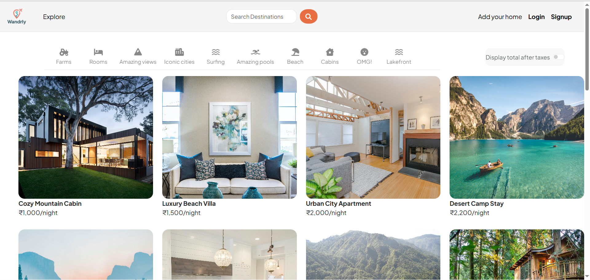
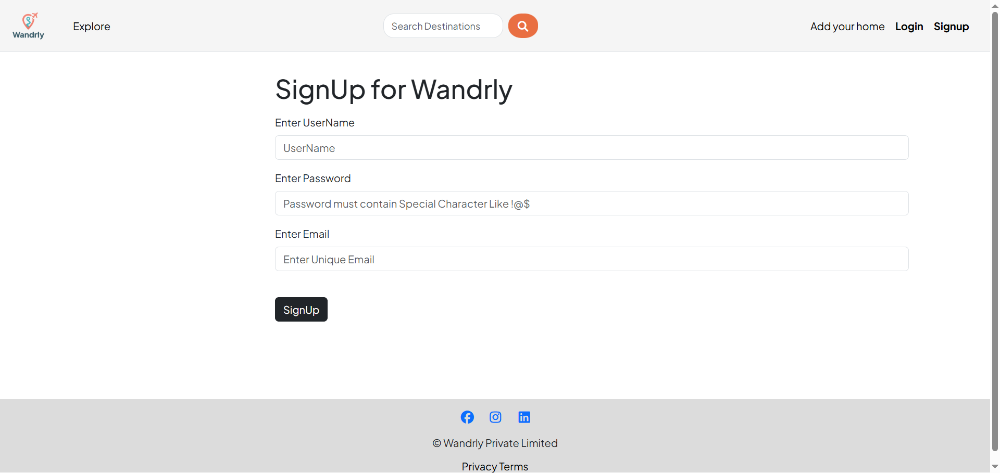
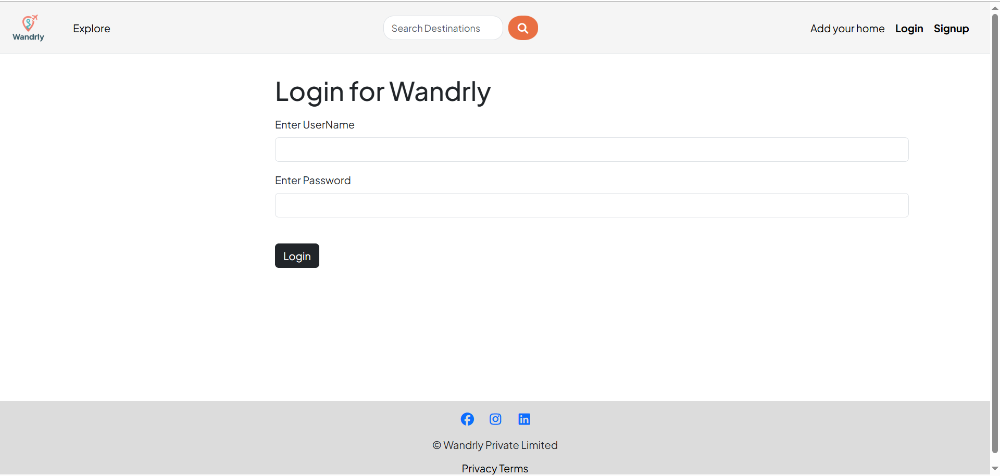

# Wandrly – Find Your Destination  
> Discover your next adventure with Wandrly: browse, plan and share travel experiences

## Table of Contents
- [About](#about)  
- [Project Demo](#project-demo)  
- [Features](#features)  
- [Tech Stack](#tech-stack)  
- [Getting Started](#getting-started)  
  - [Prerequisites](#prerequisites)  
  - [Installation](#installation)  
  - [Running the App](#running-the-app)  
- [Folder Structure](#folder-structure)  
- [Screenshots](#screenshots)  
- [Author](#author)  

---

## About  
Wandrly is a web application built to help travellers discover, plan and share their destinations.  
It allows users to browse listings, create new travel entries, upload media, and more.  
This project is for portfolio purpose not for production purposes.

---

## 🎥 Project Demo  
You can watch the project demo below 👇  

<video src="uploads/Wandrly - Ulaa 2025-10-29 11-12-34.mp4" controls width="700"></video>

---

## Features  
- User registration & authentication (sign up / login)  
- Create, edit and view travel destinations  
- Upload images/media for destinations  
- Search and filter destinations by location or tags  
- View destination details with map integration (if applicable)  
- Responsive UI for desktop & mobile  
- User Reviews, comments and ratings are also available in this app.
---

## Tech Stack  
- **Front-end:** HTML+Bootstrap+CSS
- **Back-end:** Node.js + Express  
- **Database:** MongoDB 
- **Templating:** EJS  
- **Styling:** CSS / Bootstrap
- **Other:** Cloudinary, Map APIs, Authentication (sessions)

---

## Getting Started  

### Prerequisites  
- Node.js (v14+ recommended)  
- npm or yarn  
- (If using a database) MongoDB installed or a cloud instance  
- (If using environment variables) create a `.env` file with variables such as `DB_URI`, `CLOUDINARY_URL`, `API for MAP`.

### Installation  
bash
# clone the repo  
git clone https://github.com/harshit-20-04/Wandrly-FindYourDestination.git  

# change directory  
cd Wandrly-FindYourDestination  

# install dependencies  
npm install  

---

### Running the App

# development  
npm run dev  

# or for production  
npm start  
---

## Folder Structure

Wandrly-FindYourDestination/
├─ videos/
├─ uploads/
├─ public/
│  ├─ css/
│  └─ js/
├─ src/
│  ├─ controllers/
│  ├─ models/
│  ├─ routes/
│  └─ views/
├─ .env
├─ package.json
└─ README.md
---

## Screenshots
### Home Page
</img>

### SignUp Page 
</img>

### Login Page
</img>

### Listing Page
</img>
---

## Author
**Harshit Sharma**  

👋 Full Stack Developer passionate about creating scalable and user-friendly web applications.  
💼 Skilled in MERN Stack, REST APIs, and modern front-end development.  
📫 Reach me at: [harshit2004@zohomail.in](mailto:harshit2004@zohomail.in)    
🔗 GitHub: [harshit-20-04](https://github.com/harshit-20-04)  
💼 LinkedIn: [Harshit Sharma](https://www.linkedin.com/in/harshit-sharma-ac8896)
---
